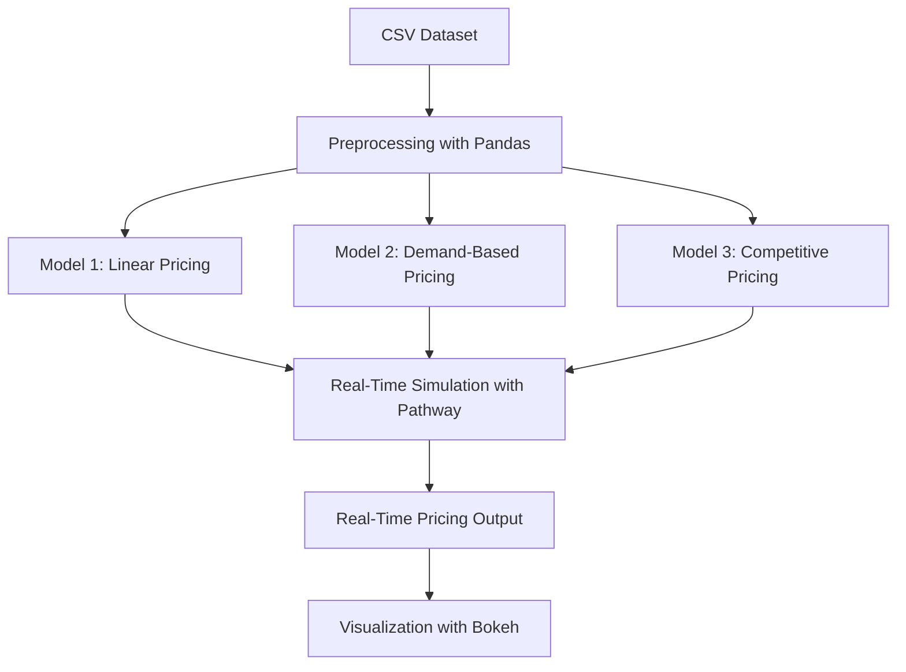

# 🚗 Dynamic Parking Pricing System

This project implements a real-time dynamic pricing system for parking lots using Python, Pandas, NumPy, Pathway, and Bokeh. It simulates live data ingestion and continuously updates parking prices based on multiple real-world features such as occupancy, queue length, traffic, special events, vehicle type, and competitor pricing.

---

## 📌 Project Objective

To build a dynamic pricing model for each parking space that:

- Starts with a base price of **$10**
- Updates pricing in real-time based on:
  - Occupancy patterns
  - Queue length
  - Nearby traffic
  - Special events
  - Vehicle type
  - Nearby competitor prices
- Provides smooth, explainable price changes
- (Optional) Suggests rerouting vehicles if a lot is overburdened

---

## 🛠️ Tech Stack

| Tool       | Purpose                            |
|------------|-------------------------------------|
| **Python** | Core programming language           |
| **Pandas** | Data preprocessing and manipulation |
| **NumPy**  | Numerical operations                |
| **Pathway**| Real-time data simulation and streaming |
| **Bokeh**  | Real-time interactive visualization |
| **Geopy**  | Calculate geographic distances      |

---

## 🧠 Project Architecture

## 🧠 Project Architecture

